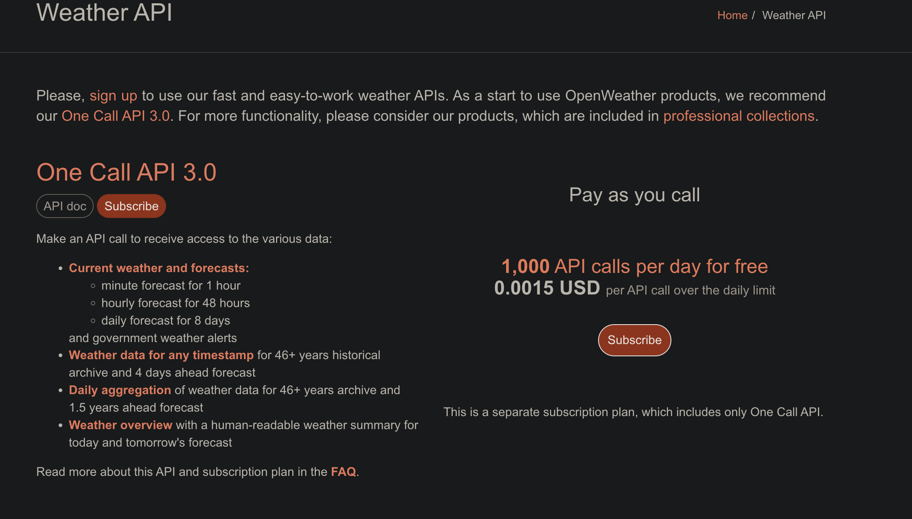

# FAQ AND TROUBLESHOOTING 

## WHICH API?
Pays as you call

## PIP Install issues
- https://stackoverflow.com/questions/42870537/zsh-command-cannot-found-pip
- https://stackoverflow.com/questions/75608323/how-do-i-solve-error-externally-managed-environment-every-time-i-use-pip-3

## Error 401: Client Error
 - Make sure you copied your API KEY correctly
 - Print your KEY within python to make sure the script is reading from .env
 - Did you just create the key? Allow up to 20 mins for it to be activated

## Need a virtual environment (VENV)
https://www.youtube.com/watch?v=GZbeL5AcTgw 

## What's a VS Code?
https://www.youtube.com/watch?v=B-s71n0dHUk

## Invalid Bucket Name
Make sure your bucket name is unique globally and isn't already in use  
Example `weather-dashboard-<insert random 5 digits here>`

## Illegal constraint error
If you're already in us-east-1 avoid using that parameter in s3 boto3

## load_dotenv() error
.env file should be "UTF-8"
Check bottom right of VS Code with .env file open
