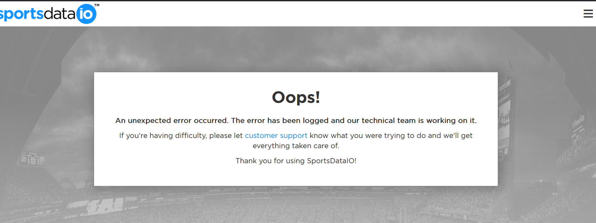
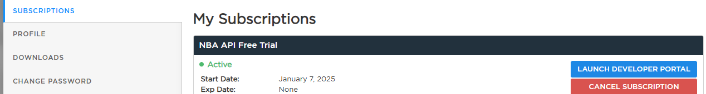
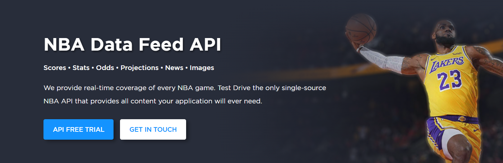
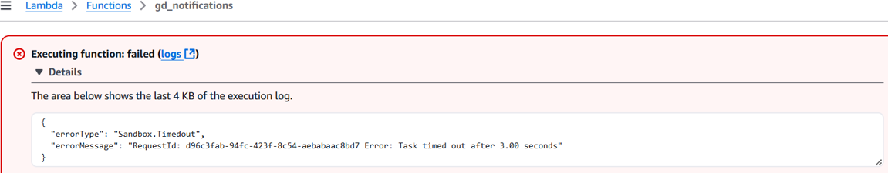

# FAQ AND TROUBLESHOOTING 

## Registration error
Use a different browser, clear cache and cookies

## Error fetching data from API: HTTP Error 401: Access Denied
- Make sure this is where you get your keys from, if it's not active here then you're on the wrong subscription
- Confirm keys are for NBA and not another sport

- Confirm that env variables in lambda config don't have spaces or tabs around it

## Task timed out after 3.00 seconds
Go to Lambda setting > Configuration > General configuration > Timeout  
Increase timeout to 10 seconds 
Learning tip: Lambda can run for a maximum of 15 minutes

