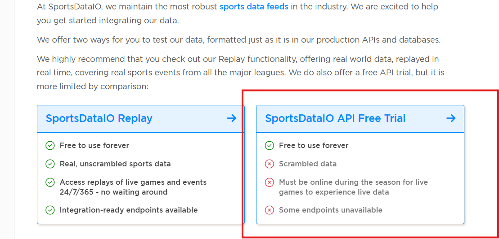

# FAQ AND TROUBLESHOOTING 

## Success message but no SNS notification
- Recopy and save the lambda code in the UI 
- When changes are made, you must click **DEPLOY** to lock in the changes before you click **TEST**


## Registration error
Use a different browser, clear cache and cookies


## Error fetching data from API: HTTP Error 401: Access Denied
- Make sure this is where you get your keys from (image below), if it's not active here then you're on the wrong subscription
- Confirm keys are for **NBA** and not another sport
- Confirm python script can print keys from .env file
- If passing variables directly into script be sure to remove `os.getenv()` 

```bash
api_key = "xyz%this#is_a+fake?key"
```




- Confirm that env variables in lambda config don't have spaces or tabs around it

## Task timed out after 3.00 seconds
Go to Lambda setting > Configuration > General configuration > Timeout <br>
Increase timeout to 10 seconds 
Learning tip: Lambda can run for a maximum of 15 minutes


