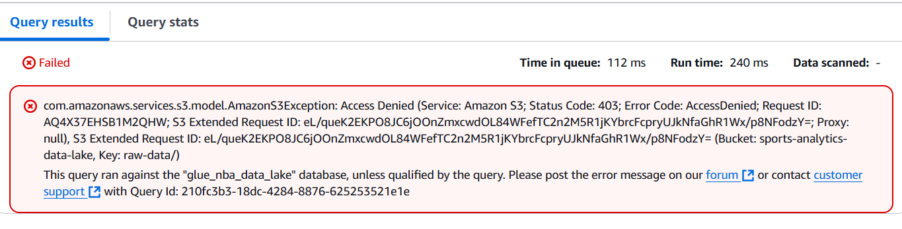
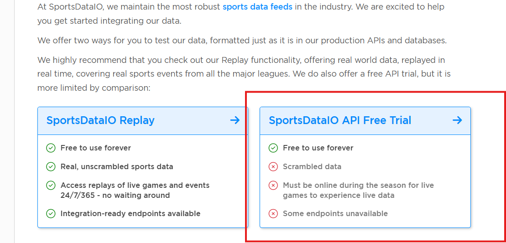

# FAQ AND TROUBLESHOOTING 

## Access Denied error
- check the table name from the code against query
- same for the database name
- IAM permissions 
- check that the endpoint is correct in the script




## Error fetching data from API: HTTP Error 401: Access Denied
- Make sure this is where you get your keys from (image below), if it's not active here then you're on the wrong subscription
- Confirm keys are for **NBA** and not another sport
- Confirm python script can print keys from .env file
- If passing variables directly into script be sure to remove `os.getenv()` 

```bash
api_key = "xyz%this#is_a+fake?key"
```


 
